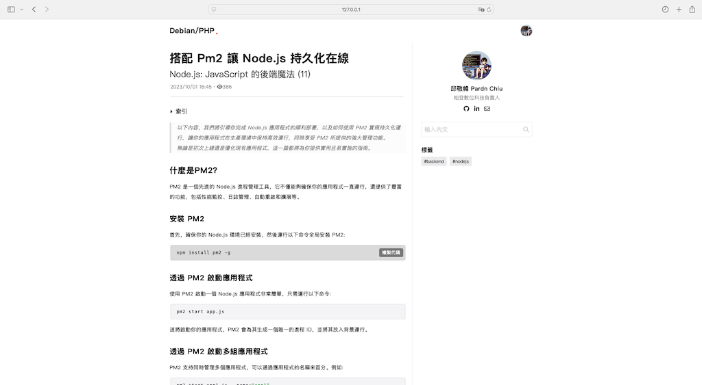

# PHP-Blog

一個功能完整的前後台部落格網站

## 特色

- 原生PHP開發
- MariaDB資料庫 
- Redis快取
- Docker部署配置
- 響應式設計

### 使用技術

- 渲染工具: [PDRenderKit](https://github.com/pardnchiu/PDRenderKit)
- Markdown編輯器: [PDMarkdownKit](https://github.com/pardnchiu/PDMarkdownKit) 
- 後台介面: [management-web](https://github.com/pardnchiu/management-web)

### 創建者

<h4 style="padding-top: 0">邱敬幃 Pardn Chiu</h4>

  

### 許可證

此源代碼專案已根據 [GPL-3.0](https://github.com/pardnchiu/PDRenderKit/blob/main/LICENSE) 許可證授權。

### 預覽

***

©️ 2024 [邱敬幃 Pardn Chiu](https://www.linkedin.com/in/pardnchiu)